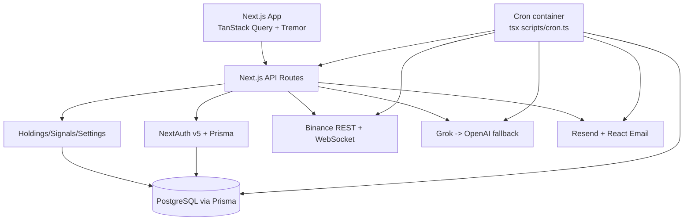

# ApexPulse Architecture



- **Auto-sync**: cron calls Binance for each user, refreshes holdings, then computes AI signals.
- **Pricing**: bulk + per-symbol fallbacks for USDT pairs; stablecoins forced to 1.0.
- **Identity**: NextAuth v5 (Credentials + Google) backed by Prisma.
- **UI**: Next.js App Router + Tailwind + shadcn + Tremor.
```
