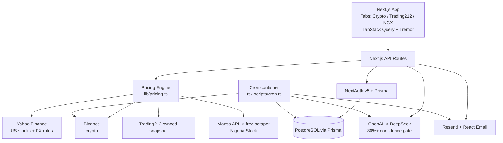

# ApexPulse Architecture

Three asset sources feed one dashboard: crypto (Binance), Trading 212, and Nigeria Stock (NGX).
A pricing engine (`lib/pricing.ts`) fans each holding out to the right source by asset
class/market and merges results back into one USD-denominated list, so no UI component needs to
know whether an asset is crypto or a stock.

See `public/architecture.svg` for the full diagram (also embedded in `/docs` in-app and the
project README).

```mermaid
flowchart TD
    Browser[Next.js App<br/>Tabs: Crypto / Trading212 / NGX<br/>TanStack Query + Tremor] --> API[Next.js API Routes]
    API --> Auth[NextAuth v5 + Prisma]
    API --> Pricing[Pricing Engine<br/>lib/pricing.ts]
    API --> AI[OpenAI -> DeepSeek<br/>80%+ confidence gate]
    API --> Email[Resend + React Email]
    Pricing --> Binance[Binance<br/>crypto]
    Pricing --> Yahoo[Yahoo Finance<br/>US stocks + FX rates]
    Pricing --> T212[Trading212 synced snapshot]
    Pricing --> NGX[Mansa API -> free scraper<br/>Nigeria Stock]
    Auth --> DB[(PostgreSQL via Prisma)]
    Cron[Cron container<br/>tsx scripts/cron.ts] --> Binance
    Cron --> AI
    Cron --> Email
    Cron --> DB
```

- **Auto-sync:** cron syncs Binance crypto holdings for each user, then computes AI signals from a
  real, liquid market snapshot. Trading 212 syncs on-demand (Settings -> "Sync Trading 212 now");
  NGX prices refresh automatically on every dashboard load.
- **Pricing:** each source converts to USD internally (`lib/fx.ts` handles live GBP/NGN rates);
  a stock holding with no live quote falls back to its own cost basis rather than pricing at $0.
  Crypto keeps its bulk + per-symbol fallback with stablecoins anchored to 1.
- **AI signals:** grounded in real Binance market data (top-volume pairs + your holdings), gated
  at 80%+ confidence with a hard backend filter -- an empty result is a valid, honest outcome.
- **Identity:** NextAuth v5 (Credentials + Google) backed by Prisma.
- **UI:** Next.js App Router + Tailwind + shadcn + Tremor/Recharts, full-width dashboard split into
  tabs (Crypto default, then Trading 212, then Nigeria Stock, plus an Other Stocks tab that only
  appears if used).
